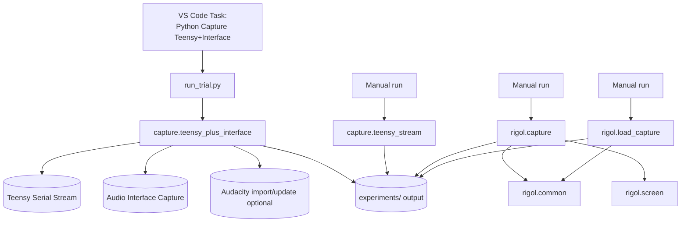

# LTDM Python Scripts
## Warning: I vibe-coded the hell out of this shit big time.
This folder contains two main workflows:

- LTDM Teensy + audio-interface capture, with optional Audacity timeline automation.
- Rigol DS1054Z data capture and review.

## Quick Start

Run an interactive trial:

```bash
cd Code/Python
python3 run_trial.py
```

Run a non-interactive trial:

```bash
cd Code/Python
python3 run_trial.py --experiment TeensyCapture --trial 1 --profile teensy_interface_no_audacity --duration 5
```

Run Teensy-only capture:

```bash
cd Code/Python
python3 -m capture.teensy_stream --port /dev/cu.usbmodem199934501 --trial 1 --duration 5 --save-wav
```

## Folder Map

- `capture/`: Teensy and interface capture implementations.
- `rigol/`: Rigol capture, scope screen, and shared Rigol plotting helpers.
- `core/`: Shared path, profile, and metadata normalisation helpers.
- `analysis/`: Post-capture plotting/inspection tools.
- `docs/`: Python-side technical schema/reference docs.
- `run_trial.py` remains the top-level interactive launcher.

## Metadata Schema

Schema design is fixed in:

- `docs/trial_metadata_schema_v2.md`

This schema is the canonical contract for trial metadata before true acquisition begins.
It defines:

- Required versus optional fields.
- Authority precedence (firmware > measured properties > Python defaults).
- Trial failure semantics.
- Relative-path policy.
- Audacity lifecycle event recording.
- Assignment map policy (including explicit `N/A` for unassigned controls).
- Required FlexPWM TDM timing metadata using meaningful labels (for example sample period, main sense pulse end, alt sense pulse start/end, actuation pulse start) with time and duty-cycle values.

Telemetry integration reads firmware `@TLM1` arm snapshots before capture marker bytes and stores the payload in trial metadata.

Ingestion/persistence writes canonical schema metadata to:

- `trials/trial_####/trial_metadata_v2.json`

Capture scripts still write their existing operational metadata files, but canonical firmware authority, FlexPWM timing, controls, stream status, and relative-path file manifests now live in `trial_metadata_v2.json`.
Operational metadata includes a `schema_v2_path` pointer so downstream tooling can resolve the canonical record directly.

Audacity lifecycle automation records concise `lifecycle_events` with UTC timestamps (launch/open-or-create/import/save/close/error) and persists Audacity status into both operational metadata and schema-v2 metadata.
For each experiment, automation uses `orchestration/<experiment_name>.aup3`: it opens this project when needed, or creates it on first save without issuing an explicit Audacity New command.
Follow-up trials default to append mode and skip explicit project reopening to avoid "already open in another window" errors; rebuild mode is only forced when track count is successfully queried and is below the required base tracks.
If Audacity is not running, automation fails fast with a recorded lifecycle error rather than hanging on script-pipe open.
To reduce post-import/save instability, additional padding is available with `--audacity-pre-save-delay` and `--audacity-post-save-delay`.
When using `run_trial.py`, these delay flags are forwarded automatically to `capture.teensy_plus_interface`.

Repository hygiene and workflow stability includes two safeguards:

- `run_trial.py` resolves script/output paths from its own file location, so it behaves consistently regardless of current working directory.
- `.gitignore` excludes generated artefacts (`.DS_Store`, `__pycache__`, `.pyc`, trial outputs, and local Audacity project sidecars).

## Folder Highlights

- `capture/teensy_plus_interface.py`: primary capture pipeline (Teensy + interface + Audacity import).
- `run_trial.py`: interactive trial runner using named capture profiles.
- `capture/teensy_stream.py`: Teensy-only binary/WAV capture.
- `rigol/capture.py`: full 4-channel DS1054Z RAW capture to HDF5 + PNG + metadata.
- `rigol/load_capture.py`: browse and plot saved Rigol captures.
- `core/experiment_profile.py`: shared experiment-level metadata loader/prompt/save helper.
- `rigol/screen.py`: capture scope screen PNG or convert saved raw screen bytes.
- `analysis/plot_teensy_stream.py`: quick matplotlib plot of Teensy `.bin` streams.
- `rigol/common.py`: shared Rigol constants/helpers/plot logic.

## Workflow Diagram



## Requirements

Use Python 3.10+ recommended.

Install core dependencies:

```bash
python3 -m pip install pyserial numpy sounddevice soundfile matplotlib h5py ds1054z python-vxi11 pillow questionary
```

Notes:
- On macOS, `sounddevice` requires microphone permissions for terminal/VS Code.
- Audacity automation requires mod-script-pipe enabled and Audacity running.

### macOS Apple Silicon note (important)

If you see an error like "incompatible architecture (have 'x86_64', need 'arm64')" when importing `matplotlib`, you are launching the script with the wrong Python interpreter.

For this repo, use the project virtual environment interpreter directly:

```bash
cd Code/Python
../../.venv/bin/python -m rigol.capture
```

If needed, reinstall the plotting stack into that same interpreter:

```bash
../../.venv/bin/python -m pip install --upgrade --force-reinstall matplotlib numpy
```

## Recommended Daily Workflow (LTDM Capture)

### Option A: VS Code task (recommended)

Run task:

- `Python: Capture Teensy+Interface (prompt trial/duration)`

This task runs `run_trial.py`, which:

- Prompts experiment name (default `TeensyCapture`) when not passed by flag.
- Suggests next trial number from `experiments/TeensyCapture/orchestration/audacity_timeline_state.json` (with folder fallback).
- Lets you override trial (including rerun of an existing trial).
- Prompts for one profile: `interface_audacity`, `interface_no_audacity`, `teensy_interface_audacity`, `teensy_interface_no_audacity`, `rigol_only`, `full_stack_audacity`, or `full_stack_no_audacity`.
- Uses duration from `orchestration/experiment_profile.json` (`duration_seconds`) for non-`rigol_only` profiles.
- Accepts `--duration` as an override for a specific run.
- For trial 2+, shows “Change user-reported variable?” with an arrow-navigable field list (current values shown) and saves any edits before capture.
- Prompts once for experiment metadata if `orchestration/experiment_profile.json` does not yet exist.
- Launches `capture.teensy_plus_interface` with project defaults.

### Capture Profiles

- `interface_audacity`: Interface recording only, with Audacity import.
- `interface_no_audacity`: Interface recording only, without Audacity import.
- `rigol_only`: Rigol capture only for the selected experiment/trial.
- `teensy_interface_audacity`: Teensy + interface recording, with Audacity import.
- `teensy_interface_no_audacity`: Teensy + interface recording, without Audacity import.
- `full_stack_audacity`: Teensy + interface + Audacity + Rigol.
- `full_stack_no_audacity`: Teensy + interface + Rigol, without Audacity import.

### Option B: direct command

```bash
cd Code/Python
python3 -m capture.teensy_plus_interface \
  --port /dev/cu.usbmodem199934501 \
  --trial 7 \
  --duration 3 \
  --iface-device 6 \
  --iface-sample-rate 192000 \
  --iface-channels 2 \
  --iface-start-mode arm-gated \
  --iface-pre-roll 0.05 \
  --iface-post-roll 0.05 \
  --iface-trim-to-teensy \
  --iface-auto-align \
  --audacity-import \
  --audacity-command-spacing 0.25 \
  --audacity-reset-passes 3 \
  --audacity-pre-import-delay 0.10 \
  --audacity-post-import-delay 0.10
```

Audio + Rigol in one run:

```bash
cd Code/Python
python3 -m capture.teensy_plus_interface \
  --port /dev/cu.usbmodem199934501 \
  --trial 7 \
  --duration 3 \
  --iface-device 6 \
  --iface-sample-rate 192000 \
  --iface-channels 2 \
  --iface-start-mode arm-gated \
  --iface-pre-roll 0.05 \
  --iface-post-roll 0.05 \
  --iface-trim-to-teensy \
  --iface-auto-align \
  --audacity-import \
  --post-rigol
```

## Script Reference

1. `run_trial.py`
Purpose: interactive daily launcher (experiment/trial/profile prompts, duration defaults, metadata edits for follow-up trials).
Run:

```bash
cd Code/Python
python3 run_trial.py
```

2. `capture/teensy_plus_interface.py`
Purpose: main synchronized capture path (Teensy + interface + optional Audacity + optional post-Rigol).
Run:

```bash
cd Code/Python
python3 -m capture.teensy_plus_interface --help
```

Key flags: `--iface-list-devices`, `--iface-start-mode`, `--iface-auto-align`, `--iface-trim-to-teensy`, `--audacity-import`, `--audacity-reset-timeline`, `--post-rigol`, `--debug`.

3. `capture/teensy_stream.py`
Purpose: Teensy-only capture, with optional WAV output.
Run:

```bash
cd Code/Python
python3 -m capture.teensy_stream --port /dev/cu.usbmodem199934501 --trial 1 --duration 5 --save-wav
```

4. `analysis/plot_teensy_stream.py`
Purpose: quick viewer for Teensy `.bin` streams.
Run:

```bash
cd Code/Python
python3 -m analysis.plot_teensy_stream experiments/TeensyCapture/trials/trial_0001/macro_audio/teensy_stream.bin --duration 1.0 --channel 1
```

5. `rigol/capture.py`
Purpose: DS1054Z RAW capture (HDF5 + PNG + scope metadata) attached to experiment/trial.
Run:

```bash
cd Code/Python
python3 -m rigol.capture
python3 -m rigol.capture --experiment MyFirstExperiment --trial 1
```

6. `rigol/load_capture.py`
Purpose: interactive loader/plotter for previous Rigol captures.
Run:

```bash
cd Code/Python
python3 -m rigol.load_capture
```

7. `rigol/screen.py`
Purpose: scope screen capture and `.bin` to `.png` conversion.
Run:

```bash
cd Code/Python
python3 -m rigol.screen --ip 169.254.123.183 --out rigol_screen.png
python3 -m rigol.screen --bin 20260811_rigol_screen.bin
```

8. `rigol/common.py` (internal shared module)
Purpose: `SCOPE_IP`, channel labels/colours, conversion helpers, and scope-style plotting utilities used by Rigol tools.

Primary per-trial outputs from the main capture path:
- `trials/trial_####/macro_audio/teensy_stream.bin`
- `trials/trial_####/macro_audio/teensy_stream_Ch1.wav`
- `trials/trial_####/macro_audio/teensy_stream_ch2.wav`
- `trials/trial_####/macro_audio/interface_capture_ch1.wav`
- `trials/trial_####/macro_audio/interface_capture_ch2.wav`
- `trials/trial_####/trial_audio_capture_metadata.json`
- `trials/trial_####/trial_metadata_v2.json`
- `trials/trial_####/trial_manifest.json`

## Data Layout

Typical output tree:

```text
Code/Python/experiments/
  TeensyCapture/
    orchestration/
      experiment_profile.json
      audacity_timeline_state.json
    trials/
      trial_0001/
        trial_manifest.json
        trial_audio_capture_metadata.json
        macro_audio/
          teensy_stream.bin
          teensy_stream_Ch1.wav
          teensy_stream_ch2.wav
          interface_capture_ch1.wav
          interface_capture_ch2.wav
        micro_scope/
          capture_001/
            rigol_capture.h5
            rigol_capture.png
            rigol_screen.png
            scope_capture_meta.json
  <OtherExperimentName>/
    orchestration/
      experiment_profile.json
    trials/
      ...
```

## Troubleshooting

Audacity import does not work:
- Open Audacity first, enable mod-script-pipe, then verify both pipes exist: `/tmp/audacity_script_pipe.to.<uid>` and `/tmp/audacity_script_pipe.from.<uid>`.

No interface input:
- List devices with `python3 -m capture.teensy_plus_interface --iface-list-devices`, then set `--iface-device` and check macOS microphone permissions.

Rigol connection fails:
- Confirm `SCOPE_IP` in `rigol/common.py`, verify LAN link, and confirm the scope is reachable on VXI-11.

## Quick Sanity Checks

Compile scripts:

```bash
cd Code/Python
python3 -m py_compile run_trial.py capture/teensy_plus_interface.py capture/teensy_stream.py rigol/capture.py rigol/load_capture.py rigol/common.py rigol/screen.py core/experiment_profile.py core/path_layout.py core/trial_metadata.py analysis/plot_teensy_stream.py
```

Run one prompted trial:

```bash
cd Code/Python
python3 run_trial.py
```
