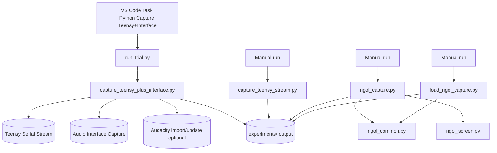

# LTDM Python Scripts
## Warning: I vibe-coded the hell out of this shit big time.
This folder contains two main workflows:

- LTDM Teensy + audio-interface capture, with optional Audacity timeline automation.
- Rigol DS1054Z data capture and review.

## Metadata Schema (Phase 1)

Phase 1 schema design is now fixed in:

- `trial_metadata_schema_v2.md`

This schema is the canonical contract for trial metadata before true acquisition begins.
It defines:

- Required versus optional fields.
- Authority precedence (firmware > measured properties > Python defaults).
- Trial failure semantics.
- Relative-path policy.
- Audacity lifecycle event recording.
- Assignment map policy (including explicit `N/A` for unassigned controls).
- Required FlexPWM TDM timing metadata using meaningful labels (for example sample period, main sense pulse end, alt sense pulse start/end, actuation pulse start) with time and duty-cycle values.

Phase 2 telemetry integration now reads firmware `@TLM1` arm snapshots before capture marker bytes and stores the payload in trial metadata.

Phase 3 ingestion/persistence now writes canonical schema metadata to:

- `trials/trial_####/trial_metadata_v2.json`

Capture scripts still write their existing operational metadata files, but canonical firmware authority, FlexPWM timing, controls, stream status, and relative-path file manifests now live in `trial_metadata_v2.json`.
Operational metadata includes a `schema_v2_path` pointer so downstream tooling can resolve the canonical record directly.

Phase 4 Audacity lifecycle automation records concise `lifecycle_events` with UTC timestamps (launch/open-or-create/import/save/close/error) and persists Audacity status into both operational metadata and schema-v2 metadata.
For each experiment, automation uses `orchestration/<experiment_name>.aup3`: it opens this project when needed, or creates it on first save without issuing an explicit Audacity New command.
Follow-up trials default to append mode and skip explicit project reopening to avoid "already open in another window" errors; rebuild mode is only forced when track count is successfully queried and is below the required base tracks.
If Audacity is not running, automation fails fast with a recorded lifecycle error rather than hanging on script-pipe open.
To reduce post-import/save instability, additional padding is available with `--audacity-pre-save-delay` and `--audacity-post-save-delay`.
When using `run_trial.py`, these delay flags are forwarded automatically to `capture_teensy_plus_interface.py`.

Phase 5 repository hygiene and workflow stability adds two safeguards:

- `run_trial.py` now resolves script/output paths from its own file location, so it behaves consistently regardless of current working directory.
- `repo_hygiene_check.py` flags accidentally tracked generated artefacts (`.DS_Store`, `__pycache__`, `.pyc`, trial outputs, and experiment Audacity `.aup3` sidecars).

Run hygiene check:

```bash
cd Code/Python
python3 repo_hygiene_check.py
```

## Folder Highlights

- `capture_teensy_plus_interface.py`: primary capture pipeline (Teensy + interface + Audacity import).
- `run_trial.py`: interactive trial runner using named capture profiles.
- `capture_teensy_stream.py`: Teensy-only binary/WAV capture.
- `rigol_capture.py`: full 4-channel DS1054Z RAW capture to HDF5 + PNG + metadata.
- `load_rigol_capture.py`: browse and plot saved Rigol captures.
- `experiment_profile.py`: shared experiment-level metadata loader/prompt/save helper.
- `rigol_screen.py`: capture scope screen PNG or convert saved raw screen bytes.
- `plot_teensy_stream.py`: quick matplotlib plot of Teensy `.bin` streams.
- `rigol_common.py`: shared Rigol constants/helpers/plot logic.

## Workflow Diagram



## Requirements

Use Python 3.10+ recommended.

Install core dependencies:

```bash
python3 -m pip install pyserial numpy sounddevice soundfile matplotlib h5py ds1054z python-vxi11 pillow questionary
```

Notes:
- On macOS, `sounddevice` requires microphone permissions for terminal/VS Code.
- Audacity automation requires mod-script-pipe enabled and Audacity running.

### macOS Apple Silicon note (important)

If you see an error like "incompatible architecture (have 'x86_64', need 'arm64')" when importing `matplotlib`, you are launching the script with the wrong Python interpreter.

For this repo, use the project virtual environment interpreter directly:

```bash
cd Code/Python
../../.venv/bin/python rigol_capture.py
```

If needed, reinstall the plotting stack into that same interpreter:

```bash
../../.venv/bin/python -m pip install --upgrade --force-reinstall matplotlib numpy
```

## Recommended Daily Workflow (LTDM Capture)

### Option A: VS Code task (recommended)

Run task:

- `Python: Capture Teensy+Interface (prompt trial/duration)`

This task runs `run_trial.py`, which:

- Prompts experiment name (default `TeensyCapture`) when not passed by flag.
- Suggests next trial number from `experiments/TeensyCapture/orchestration/audacity_timeline_state.json` (with folder fallback).
- Lets you override trial (including rerun of an existing trial).
- Prompts for one profile: `interface_audacity`, `interface_no_audacity`, `teensy_interface_audacity`, `teensy_interface_no_audacity`, `rigol_only`, `full_stack_audacity`, or `full_stack_no_audacity`.
- Uses duration from `orchestration/experiment_profile.json` (`duration_seconds`) for non-`rigol_only` profiles.
- Accepts `--duration` as an override for a specific run.
- For trial 2+, shows “Change user-reported variable?” with an arrow-navigable field list (current values shown) and saves any edits before capture.
- Prompts once for experiment metadata if `orchestration/experiment_profile.json` does not yet exist.
- Launches `capture_teensy_plus_interface.py` with project defaults.

### Capture Profiles

- `interface_audacity`: Interface recording only, with Audacity import.
- `interface_no_audacity`: Interface recording only, without Audacity import.
- `rigol_only`: Rigol capture only for the selected experiment/trial.
- `teensy_interface_audacity`: Teensy + interface recording, with Audacity import.
- `teensy_interface_no_audacity`: Teensy + interface recording, without Audacity import.
- `full_stack_audacity`: Teensy + interface + Audacity + Rigol.
- `full_stack_no_audacity`: Teensy + interface + Rigol, without Audacity import.

### Option B: direct command

```bash
cd Code/Python
python3 capture_teensy_plus_interface.py \
  --port /dev/cu.usbmodem199934501 \
  --trial 7 \
  --duration 3 \
  --iface-device 6 \
  --iface-sample-rate 192000 \
  --iface-channels 2 \
  --iface-start-mode arm-gated \
  --iface-pre-roll 0.05 \
  --iface-post-roll 0.05 \
  --iface-trim-to-teensy \
  --iface-auto-align \
  --audacity-import \
  --audacity-command-spacing 0.25 \
  --audacity-reset-passes 3 \
  --audacity-pre-import-delay 0.10 \
  --audacity-post-import-delay 0.10
```

Audio + Rigol in one run:

```bash
cd Code/Python
python3 capture_teensy_plus_interface.py \
  --port /dev/cu.usbmodem199934501 \
  --trial 7 \
  --duration 3 \
  --iface-device 6 \
  --iface-sample-rate 192000 \
  --iface-channels 2 \
  --iface-start-mode arm-gated \
  --iface-pre-roll 0.05 \
  --iface-post-roll 0.05 \
  --iface-trim-to-teensy \
  --iface-auto-align \
  --audacity-import \
  --post-rigol
```

## Script Reference

## 1) `capture_teensy_plus_interface.py`

Primary synchronized capture script.

What it does:
- Arms Teensy and captures serial stream (2ch).
- Parses `@TLM1` telemetry frames between `ARMED` and marker (`0xAA55`) and stores the `arm_snapshot` payload.
- Uses firmware-reported samplerate when present, with Python fallback to 20 kHz.
- Captures interface audio (multi-channel, typically 2ch at 192 kHz).
- Optionally auto-aligns interface to Teensy via envelope correlation.
- Optionally trims interface exactly to Teensy duration.
- Loads shared experiment metadata from `orchestration/experiment_profile.json` and stores a trial snapshot.
- Writes per-trial WAVs + metadata JSON.
- Can optionally launch Rigol capture for the same experiment/trial after audio files are saved.
- Optionally imports/appends clips to 4 fixed Audacity tracks.

Key outputs per trial:
- `trials/trial_####/macro_audio/teensy_stream.bin`
- `trials/trial_####/macro_audio/teensy_stream_Ch1.wav`
- `trials/trial_####/macro_audio/teensy_stream_ch2.wav`
- `trials/trial_####/macro_audio/interface_capture_ch1.wav`
- `trials/trial_####/macro_audio/interface_capture_ch2.wav`
- `trials/trial_####/trial_audio_capture_metadata.json`
- `trials/trial_####/trial_metadata_v2.json`
- `trials/trial_####/trial_manifest.json`

Useful flags:
- `--iface-list-devices`
- `--iface-start-mode marker|arm|arm-gated`
- `--iface-auto-align` / `--iface-no-auto-align`
- `--iface-trim-to-teensy` / `--iface-no-trim-to-teensy`
- `--audacity-import` / `--no-audacity-import`
- `--audacity-reset-timeline`
- `--post-rigol`
- `--debug`

## 2) `run_trial.py`

Interactive launcher for the main capture script.

What it does:
- Reads prior timeline state.
- Proposes auto-incremented trial.
- Prompts experiment + trial + profile in terminal.
- Uses `duration_seconds` from experiment metadata for non-`rigol_only` profiles, unless `--duration` is provided.
- For trial 2+, prompts to edit user-reported metadata fields (including duration) before the run.
- Supports `--profile`, `--duration` override, and `--debug`.
- Runs the full capture command with known-good defaults.

Run:

```bash
cd Code/Python
python3 run_trial.py
```

## 3) `capture_teensy_stream.py`

Teensy-only capture utility.

What it does:
- Arms Teensy and waits for capture marker.
- Parses `@TLM1` telemetry frames after `ARMED` and before marker.
- Captures binary stream for requested duration.
- Teensy capture duration range is 1 to 120 seconds.
- Uses firmware-reported samplerate for byte-count and WAV sample-rate when available.
- Loads shared experiment metadata from `orchestration/experiment_profile.json` and stores a trial snapshot.
- Saves raw channel splits, optional WAVs, and `trial_metadata_v2.json`.

Run example:

```bash
cd Code/Python
python3 capture_teensy_stream.py \
  --port /dev/cu.usbmodem199934501 \
  --trial 1 \
  --duration 5 \
  --save-wav
```

## 4) `plot_teensy_stream.py`

Quick waveform viewer for Teensy `.bin` captures.

Run example:

```bash
cd Code/Python
  python3 plot_teensy_stream.py experiments/TeensyCapture/trials/trial_0001/macro_audio/teensy_stream.bin --duration 1.0 --channel 1
```

## 5) `rigol_capture.py`

Interactive DS1054Z RAW waveform capture.

What it does:
- Loads or updates shared experiment metadata in `orchestration/experiment_profile.json`.
- Prompts for channel labels only during scope capture, since they are scope-specific.
- Connects to Rigol via LAN/VXI-11 using `SCOPE_IP` from `rigol_common.py`.
- Captures scope screen.
- Stops scope if needed.
- Reads 6M-point RAW data for all 4 channels.
- Saves HDF5 + scope metadata + rendered PNG under the corresponding trial's `micro_scope/capture_###` folder and updates `trial_manifest.json`.

Run:

```bash
cd Code/Python
python3 rigol_capture.py
```

Attach Rigol to an existing experiment/trial without re-entering them:

```bash
cd Code/Python
python3 rigol_capture.py --experiment MyFirstExperiment --trial 1
```

## 6) `load_rigol_capture.py`

Interactive loader/viewer for prior Rigol captures.

Run:

```bash
cd Code/Python
python3 load_rigol_capture.py
```

## 7) `rigol_screen.py`

Screen capture/conversion helper.

Live capture:

```bash
cd Code/Python
python3 rigol_screen.py --ip 169.254.123.183 --out rigol_screen.png
```

Convert existing raw screen file:

```bash
cd Code/Python
python3 rigol_screen.py --bin 20260811_rigol_screen.bin
```

## 8) `rigol_common.py`

Shared module used by Rigol scripts.

Contains:
- `SCOPE_IP`
- Channel mappings/colors
- RAW count to voltage conversion
- Scope-style plotting + zoom/decimation behavior

## Data Layout

Typical output tree:

```text
Code/Python/experiments/
  TeensyCapture/
    orchestration/
      experiment_profile.json
      audacity_timeline_state.json
    trials/
      trial_0001/
        trial_manifest.json
        trial_audio_capture_metadata.json
        macro_audio/
          teensy_stream.bin
          teensy_stream_Ch1.wav
          teensy_stream_ch2.wav
          interface_capture_ch1.wav
          interface_capture_ch2.wav
        micro_scope/
          capture_001/
            rigol_capture.h5
            rigol_capture.png
            rigol_screen.png
            scope_capture_meta.json
  <OtherExperimentName>/
    orchestration/
      experiment_profile.json
    trials/
      ...
```

## Troubleshooting

Audacity import does not work:
- Confirm Audacity is open.
- Confirm mod-script-pipe is enabled.
- Confirm pipe files exist at `/tmp/audacity_script_pipe.to.<uid>` and `/tmp/audacity_script_pipe.from.<uid>`.

No interface input:
- Run `capture_teensy_plus_interface.py --iface-list-devices`.
- Verify `--iface-device` index/name.
- Check macOS microphone permissions.

Rigol connection fails:
- Verify scope IP in `rigol_common.py`.
- Confirm LAN link and that scope responds on VXI-11.

## Quick Sanity Checks

Compile scripts:

```bash
cd Code/Python
python3 -m py_compile capture_teensy_plus_interface.py run_trial.py
```

Run one prompted trial:

```bash
cd Code/Python
python3 run_trial.py
```
