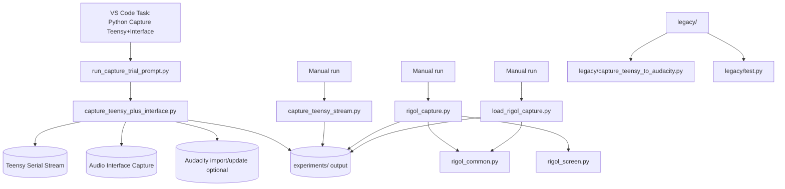

# LTDM Python Scripts
# warning: I vibe-coded the hell out of this shit big time.

This folder contains two main workflows:

- LTDM Teensy + audio-interface capture, with optional Audacity timeline automation.
- Rigol DS1054Z waveform/screenshot capture and review.

## Folder Highlights

- `capture_teensy_plus_interface.py`: primary capture pipeline (Teensy + interface + Audacity import).
- `run_capture_trial_prompt.py`: interactive launcher that prompts trial and duration.
- `capture_teensy_stream.py`: Teensy-only binary/WAV capture.
- `legacy/capture_teensy_to_audacity.py`: older Teensy + Audacity flow (kept for reference/troubleshooting).
- `rigol_capture.py`: full 4-channel DS1054Z RAW capture to HDF5 + PNG + metadata.
- `load_rigol_capture.py`: browse and plot saved Rigol captures.
- `rigol_screen.py`: capture scope screen PNG or convert saved raw screen bytes.
- `plot_teensy_stream.py`: quick matplotlib plot of Teensy `.bin` streams.
- `rigol_common.py`: shared Rigol constants/helpers/plot logic.
- `legacy/test.py`: utility script for inspecting raw Rigol screen `.bin` files.

## Workflow Diagram



## Requirements

Use Python 3.10+ recommended.

Install core dependencies:

```bash
python3 -m pip install pyserial numpy sounddevice soundfile matplotlib h5py ds1054z python-vxi11 pillow questionary
```

Notes:
- On macOS, `sounddevice` requires microphone permissions for terminal/VS Code.
- Audacity automation requires mod-script-pipe enabled and Audacity running.

## Recommended Daily Workflow (LTDM Capture)

### Option A: VS Code task (recommended)

Run task:

- `Python: Capture Teensy+Interface (prompt trial/duration)`

This task runs `run_capture_trial_prompt.py`, which:

- Suggests next trial number from `experiments/TeensyCapture/audacity_timeline_state.json`.
- Lets you override trial (including rerun of an existing trial).
- Prompts duration in seconds.
- Launches `capture_teensy_plus_interface.py` with project defaults.

### Option B: direct command

```bash
cd Code/Python
python3 capture_teensy_plus_interface.py \
  --port /dev/cu.usbmodem199934501 \
  --trial 7 \
  --duration 3 \
  --iface-device 6 \
  --iface-sample-rate 192000 \
  --iface-channels 2 \
  --iface-start-mode arm-gated \
  --iface-pre-roll 0.05 \
  --iface-post-roll 0.05 \
  --iface-trim-to-teensy \
  --iface-auto-align \
  --audacity-import \
  --audacity-command-spacing 0.25 \
  --audacity-reset-passes 3 \
  --audacity-pre-import-delay 0.10 \
  --audacity-post-import-delay 0.10
```

## Script Reference

## 1) `capture_teensy_plus_interface.py`

Primary synchronized capture script.

What it does:
- Arms Teensy and captures serial stream (2ch, 20 kHz).
- Captures interface audio (multi-channel, typically 2ch at 192 kHz).
- Optionally auto-aligns interface to Teensy via envelope correlation.
- Optionally trims interface exactly to Teensy duration.
- Writes per-trial WAVs + metadata JSON.
- Optionally imports/appends clips to 4 fixed Audacity tracks.

Key outputs per trial:
- `teensy_stream.bin`
- `teensy_stream_Ch1.wav`
- `teensy_stream_ch2.wav`
- `interface_capture_ch1.wav`
- `interface_capture_ch2.wav`
- `teensy_interface_capture_metadata.json`

Useful flags:
- `--iface-list-devices`
- `--iface-start-mode marker|arm|arm-gated`
- `--iface-auto-align` / `--iface-no-auto-align`
- `--iface-trim-to-teensy` / `--iface-no-trim-to-teensy`
- `--audacity-import` / `--no-audacity-import`
- `--audacity-reset-timeline`

## 2) `run_capture_trial_prompt.py`

Interactive launcher for the main capture script.

What it does:
- Reads prior timeline state.
- Proposes auto-incremented trial.
- Prompts trial + duration in terminal.
- Runs the full capture command with known-good defaults.

Run:

```bash
cd Code/Python
python3 run_capture_trial_prompt.py
```

## 3) `capture_teensy_stream.py`

Teensy-only capture utility.

What it does:
- Arms Teensy and waits for capture marker.
- Captures binary stream for requested duration.
- Saves raw channel splits and optional WAVs.

Run example:

```bash
cd Code/Python
python3 capture_teensy_stream.py \
  --port /dev/cu.usbmodem199934501 \
  --trial 1 \
  --duration 5 \
  --save-wav
```

## 4) `legacy/capture_teensy_to_audacity.py`

Legacy Audacity automation script.

Use this mainly for regression/troubleshooting versus the newer pipeline.

Run example:

```bash
cd Code/Python
python3 legacy/capture_teensy_to_audacity.py --port /dev/cu.usbmodem199934501
```

## 5) `plot_teensy_stream.py`

Quick waveform viewer for Teensy `.bin` captures.

Run example:

```bash
cd Code/Python
python3 plot_teensy_stream.py experiments/TeensyCapture/trial_1/teensy_stream.bin --duration 1.0 --channel 1
```

## 6) `rigol_capture.py`

Interactive DS1054Z RAW waveform capture.

What it does:
- Connects to Rigol via LAN/VXI-11 using `SCOPE_IP` from `rigol_common.py`.
- Captures scope screen.
- Stops scope if needed.
- Reads 6M-point RAW data for all 4 channels.
- Saves HDF5 + trial metadata + rendered PNG.

Run:

```bash
cd Code/Python
python3 rigol_capture.py
```

## 7) `load_rigol_capture.py`

Interactive loader/viewer for prior Rigol captures.

Run:

```bash
cd Code/Python
python3 load_rigol_capture.py
```

## 8) `rigol_screen.py`

Screen capture/conversion helper.

Live capture:

```bash
cd Code/Python
python3 rigol_screen.py --ip 169.254.123.183 --out rigol_screen.png
```

Convert existing raw screen file:

```bash
cd Code/Python
python3 rigol_screen.py --bin 20260811_rigol_screen.bin
```

## 9) `rigol_common.py`

Shared module used by Rigol scripts.

Contains:
- `SCOPE_IP`
- Channel mappings/colors
- RAW count to voltage conversion
- Scope-style plotting + zoom/decimation behavior

## 10) `legacy/test.py`

Small diagnostic utility for raw scope screen bytes.

Use when debugging corrupted/partial `.bin` screen captures.

Run:

```bash
cd Code/Python
python3 legacy/test.py
```

## Data Layout

Typical output tree:

```text
Code/Python/experiments/
  TeensyCapture/
    audacity_timeline_state.json
    trial_1/
    trial_2/
  <RigolExperimentName>/
    experiment.json
    trial_1/
      rigol_capture.h5
      rigol_capture.png
      rigol_screen.png
      trial_metadata.json
```

## Troubleshooting

Audacity import does not work:
- Confirm Audacity is open.
- Confirm mod-script-pipe is enabled.
- Confirm pipe files exist at `/tmp/audacity_script_pipe.to.<uid>` and `/tmp/audacity_script_pipe.from.<uid>`.

No interface input:
- Run `capture_teensy_plus_interface.py --iface-list-devices`.
- Verify `--iface-device` index/name.
- Check macOS microphone permissions.

Rigol connection fails:
- Verify scope IP in `rigol_common.py`.
- Confirm LAN link and that scope responds on VXI-11.

## Quick Sanity Checks

Compile scripts:

```bash
cd Code/Python
python3 -m py_compile capture_teensy_plus_interface.py run_capture_trial_prompt.py
```

Run one prompted trial:

```bash
cd Code/Python
python3 run_capture_trial_prompt.py
```
