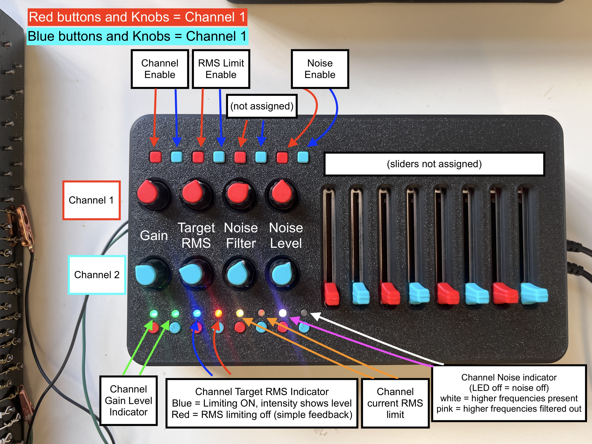

# LTDM Kit Rev C

Firmware and hardware assets for a Teensy 4.1 based LTDM (Lorentz Time-Domain Multiplex) kit.

### Programming
Iterate quickly on dsp and string behavior in `Code/LTDM_Kit/render.cpp`, leaving precise timing of sensing and actuating untouched by user.
### Interaction
Map hardware controls (buttons/sliders/pedals) to your algorithm through the UI layer.

## Project Structure

- `Code/LTDM_Kit`: Firmware running on Teensy 4.1
- `Code/Python`: capture, analysis, and Audacity automation scripts
- `Code/LTDM_Kit_Control.maxpat`: a maxpatch for overriding the LTDM Kit physical UI or running LTDM kit main board without UI.
- `Electronics`: KiCad project (schematic and pcb) for PCB design
- `CAD`: mechanical STEP/STL assets for enclosure

## Program and Upload
Firmware can be edited and uploaded to the teensy 4.1 via the Arduino 2.X IDE or from VS code.

### Arduino IDE
To use the Arduino IDE, you will need to [(install the Arduino IDE)](https://support.arduino.cc/hc/en-us/articles/360019833020-Download-and-install-Arduino-IDE). Once installed, download the Teensy Board library by following the instructions [(here)](https://www.pjrc.com/teensy/td_download.html).

After firmware changes are made, make sure the teensy is connected and seen by the dropdown menu in the upper left of the IDE. Use the 'upload' button next to this to flash new firmware.

### Arduino CLI (direct)
If this is your first time connecting from a new machine, run this one-time setup first:

1. Install Arduino CLI.
2. Add the Teensy board index URL.
3. Update board indexes and install the Teensy core.
4. Plug in Teensy 4.1 with a data-capable USB cable.
5. Verify the detected USB port before upload.

Example one-time setup commands:

```bash
# Add PJRC Teensy package index (safe to run again if already present)
arduino-cli config add board_manager.additional_urls https://www.pjrc.com/teensy/package_teensy_index.json

# Refresh indexes and install Teensy core
arduino-cli core update-index
arduino-cli core install teensy:avr

# Confirm Teensy core is installed
arduino-cli core list
```

Check that your Teensy is visible and note its port:

```bash
arduino-cli board list
```

On macOS, Teensy ports commonly look like `/dev/cu.usbmodem*`.

To flash code directly from terminal:

```bash
cd Code/LTDM_Kit
arduino-cli compile --fqbn teensy:avr:teensy41 .
arduino-cli upload --fqbn teensy:avr:teensy41 -p /dev/cu.usbmodemXXXX .
```

### VS Code tasks
To flash firmware from VS code, you can use the premade VS code tasks by using `Cmd+Shift+P` -> `Tasks: Run Task` and select:

- `Teensy: Compile LTDM_Kit`
- `Teensy: Upload LTDM_Kit (prompt port)`
- `Teensy: Upload LTDM_Kit (auto port)`
- `Teensy: Compile + Upload LTDM_Kit (auto port)`

Task definitions live in `.vscode/tasks.json`.

## How the Firmware is Organized

### Essential core files (base firmware)

- `LTDM_Kit.ino`: startup order and top-level loop (`setup()` and `loop()`).
- `flexpwm.cpp` / `flexpwm.h`: hardware timing, ISR, ADC reads, and PWM update path.
- `render.cpp` / `render.h`: per-sample behavior, where algorithm/control logic is authored.
- `ui.cpp` / `ui.h`: physical control scan (buttons/sliders/pedals), LED updates, and serial telemetry printout.
- `channel.h`: per-channel runtime/state struct fields used by ISR and render.
- `context.h`: shared frame context passed into `render()` each sample.
- `pinmap.h`: board pin assignments and hardware routing constants.
- `system_config.h`: global compile-time configuration (sample rate, buffer sizes, PWM resolution).

### Optional or bonus helper modules

These are useful, but not strictly required for a minimal "sense -> render -> actuate" base path.

- `serialctrl.cpp` / `serialctrl.h`: optional host serial override of hardware UI state (used by Max patch control).
- `capture_stream.cpp` / `capture_stream.h`: optional deterministic capture trigger and streaming for measurement scripts.
- `harmonics.cpp` / `harmonics.h`: additive harmonic oscillator bank and zero-crossing pitch tracking.
- `visualAlias.cpp` / `visualAlias.h`: optional visual phase alias output behavior by plugging a 12V LED strip into one of the channels.
- `SineTable.cpp` / `SineTable.h`: lookup-table sine source used by harmonic/visual helper DSP.
- `debug.h`: compile-time debug print macros (`DEBUG_PRINT`, `DEBUG_PRINTLN`).

At runtime, the flow is:

1. ISR acquires channel state and UI state into `context`.
2. `render(context)` computes output values once per sample.
3. PWM/sense outputs are driven from those computed values.

## Codebase division-of-labor

This codebase intentionally separates three concerns:

1. Real-time infrastructure: sample timing, GPIO/PWM scheduling, ADC/sense capture.
2. Control surface: what knobs/buttons/pedals currently mean.
3. Algorithm: how measured input becomes actuation output.

The design goal is to let you iterate and develop actuation and feedback behavior without destabilizing anything with critical timing, such as the regular periodic sense + actuate loop.

In practice, treat `render.cpp` as your sandbox for algorithmic ideas:

- Feedback shaping
- Noise injection and excitation strategies
- RMS/energy targeting
- Harmonic synthesis
- Cross-channel coupling experiments

## Where to Make Changes

### Audio/actuation behavior

Edit `Code/LTDM_Kit/render.cpp`.

Key entry points:

- `bool renderSetup(LorentzContext *context)` for one-time setup
- `void render(LorentzContext *context)` for per-sample behavior

Useful signals available from `context`:

- `context->ch[0].in`, `context->ch[1].in` (channel's sensed audio input)
- `context->buttons[0]` (button 0-7 are the latching buttons, and 6-15 are the momentary push buttons)
- `context->sliders[0..15]` (slider 0-7 are the potentiometers, 8-15 are the sliders)
- `context->pedals[0..1]` (optionally connect up to 2 expression pedals)

### Button/slider behavior mapping

Edit `Code/LTDM_Kit/ui.cpp` and `Code/LTDM_Kit/render.cpp` together.

How it works:

1. `ui.cpp` scans physical mux inputs and sets UI LED outputs.
2. `render.cpp` assigns meaning to those logical indices.

### Pin assignments

Edit `Code/LTDM_Kit/pinmap.h` only if attaching additional functions to the available GPIOs.

### Render/control behavior (channel 1 focused)



In `Code/LTDM_Kit/render.cpp`:

- Button 0/1 enables channel 1 and 2 output respectively (`enablePin` high/low).
- Button 2 toggles RMS-targeted gain behavior for CH1.
- Button 6 gates CH1 noise injection.
- Button 8 requests capture start while capture is armed.

- Slider 0: CH1 feedback gain (`fbGain`).
- Slider 1: CH1 target RMS.
- Slider 2: noise update rate (acts like coarse smoothing on random term).
- Slider 3: CH1 noise scale.
- Slider 4: harmonic frequency smoothing parameter (`alpha`).
- Sliders 8..15: gains for harmonics 1..8 (`NUM_HARMONICS = 8`).

- Note: Channel 2 currently carries visual-alias pulse output behavior (`renderLEDPulse(...)`) rather than string feedback behavior

### LED/UI feedback

In `Code/LTDM_Kit/ui.cpp`:

- TLC5947 LEDs reflect enable/limit/target and measured RMS states.
- UI scan runs in two-phase mux read/write cycles.
- `output()` also prints debug telemetry over serial every ~100 ms (as long as the the python audio capture stream is idle.)

### Serial override mode

`Code/LTDM_Kit/serialctrl.cpp` can override hardware controls via framed serial packets. There is an example max/msp patch ('LTDM_Kit_Control.maxpat') that already has this setup.

- Start marker: `255`
- End marker: `254`
- Payload: mode + 16 sliders + 16 buttons + 2 pedals (34 bytes)

When override is active, incoming values are written directly into the shared UI state arrays.

## Python Tools

The Python tools in `Code/Python` are used for measurement, capture automation, and analysis around the firmware:

- `capture_teensy_plus_interface.py`: Capture audio directly from Teensy (what the teensy 'hears' from the EMF sensing circuitry) and 2 channels of audio from a connected audio interface. Optionally import these files directly to audacity.
- `run_capture_trial_prompt.py`: Prompt for trial/duration and launch the full capture pipeline with known-good defaults.
- `legacy/capture_teensy_to_audacity.py`: Legacy Teensy capture + Audacity automation flow for troubleshooting or comparison.
- `capture_teensy_stream.py`: Capture Teensy stream only (without interface capture), with optional WAV export.
- `rigol_capture.py`: Run Rigol DS1054Z waveform/screenshot capture and write trial metadata.
- `load_rigol_capture.py`: Load and interactively inspect saved Rigol capture files.
- `rigol_screen.py`: Capture or convert Rigol's screen images.
- `plot_teensy_stream.py`: Plot saved Teensy stream files for quick signal inspection.

If you are starting from scratch, run this script first:

- `Code/Python/run_capture_trial_prompt.py`

It prompts for trial and duration, auto-suggests the next trial number, and launches the full capture pipeline with known-good defaults.

Full Python docs:

- `Code/Python/PYTHONS_README.md`
